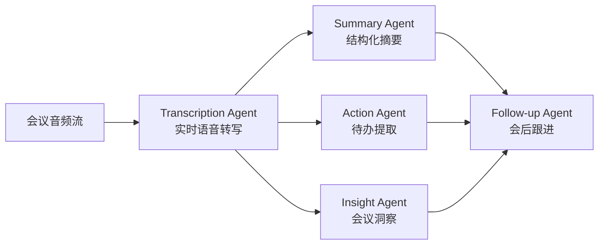

# 多Agent智能会议助手系统 - 完整项目规划

## 一、项目概述

构建企业级5-Agent智能会议助手系统，采用 Pipeline + 并行编排模式，支持 Python 语言实现。配套面试全套准备材料，面向小白从0到面试通关。

## 二、项目架构设计



**编排模式**: Pipeline(音频->转写) + 并行(摘要/待办/洞察同步执行) + 汇聚(跟进Agent)

## 三、语言技术栈

### Python 版（主力版本，最完整）
- **Agent框架**: LangGraph (状态图编排)
- **语音转写**: Qwen3ASR + pyannote-audio (说话人识别)
- **LLM**: MiniMax M2.7 / OpenAI API
- **WebSocket**: FastAPI + websockets (实时通信)
- **外部集成**: jira-python / 飞书 Open API SDK
- **向量存储**: ChromaDB (会议记忆)
- **部署**: Docker + docker-compose

## 四、目录结构

```
multi-agent-meeting-assistant/
├── README.md                          # 超详细README（带目录、超链接、架构图）
├── docs/
│   ├── architecture.md                # 架构设计详解
│   ├── interview/
│   │   ├── eight-part-essay.md        # 八股文大全（50+题）
│   │   ├── star-method.md             # STAR法面试话术
│   │   ├── resume-template.md         # 简历模板与写法
│   │   ├── project-qa.md              # 项目常见面试问答
│   │   └── system-design.md           # 系统设计面试要点
│   ├── tutorial/
│   │   ├── 00-prerequisites.md        # 环境准备（小白版）
│   │   ├── 01-understanding-agents.md # Agent概念入门
│   │   ├── 02-first-agent.md          # 第一个Agent
│   │   ├── 03-multi-agent.md          # 多Agent编排
│   │   ├── 04-meeting-system.md       # 会议系统实战
│   │   └── 05-deployment.md           # 部署上线
│   └── api-reference.md               # API文档
├── python/
│   ├── README.md
│   ├── requirements.txt
│   ├── pyproject.toml
│   ├── src/
│   │   ├── agents/
│   │   │   ├── transcription_agent.py # 转写Agent
│   │   │   ├── summary_agent.py       # 摘要Agent
│   │   │   ├── action_agent.py        # 待办Agent
│   │   │   ├── insight_agent.py       # 洞察Agent
│   │   │   └── followup_agent.py      # 跟进Agent
│   │   ├── graph/
│   │   │   └── meeting_graph.py       # LangGraph编排
│   │   ├── integrations/
│   │   │   ├── jira_client.py         # Jira集成
│   │   │   ├── feishu_client.py       # 飞书集成
│   │   │   └── minimax_client.py      # MiniMax LLM
│   │   ├── models/
│   │   │   └── schemas.py             # 数据模型
│   │   ├── websocket/
│   │   │   └── server.py              # WebSocket服务
│   │   └── main.py                    # 入口
│   ├── tests/
│   └── docker-compose.yml
└── plan.md                            # 本计划文档
```

## 五、5个Agent核心实现要点

### 1. Transcription Agent (转写Agent)
- **输入**: 音频流 (WebSocket 二进制帧)
- **处理**: Qwen3ASR 实时转写 + pyannote说话人分离
- **输出**: `{speaker: "张总", text: "Q3预算需要上调", timestamp: "00:03:15"}`
- **关键技术**: VAD预处理降低幻觉、流式分块转写、说话人embedding缓存

### 2. Summary Agent (摘要Agent)
- **输入**: 完整转写文本
- **处理**: LLM结构化提取 (议题/讨论要点/结论/决策)
- **输出**: Markdown格式会议纪要
- **Prompt设计**: 使用Few-shot + 结构化输出约束(JSON Schema)

### 3. Action Agent (待办Agent)
- **输入**: 完整转写文本
- **处理**: LLM提取 + NER增强 (谁/做什么/截止时间)
- **输出**: `{assignee: "李明", task: "完成Q3预算方案", deadline: "2026-04-15"}`
- **集成**: 自动创建Jira Issue / 飞书任务

### 4. Insight Agent (洞察Agent)
- **输入**: 转写文本 + 音频特征
- **处理**: 情感分析(LLM) + 发言统计(规则) + 效率评分(综合)
- **输出**: `{sentiment: "积极", speaking_ratio: {...}, efficiency_score: 8.2}`

### 5. Follow-up Agent (跟进Agent)
- **输入**: 摘要 + 待办 + 洞察 (三个Agent的汇聚)
- **处理**: 生成跟进邮件/消息 + 设置提醒 + 跟踪待办
- **输出**: 飞书消息推送 + 定时提醒任务

## 六、面试准备材料（docs/interview/）

### 八股文 50+ 题（eight-part-essay.md）

涵盖以下分类：
- **Agent基础**: Agent vs Chain区别、ReAct模式、Planning/Memory/Tool三要素
- **多Agent**: 为什么要多Agent、三种协作模式(Boss-Worker/Pipeline/民主)、通信机制
- **LangGraph**: 状态图原理、Node/Edge/State概念、条件路由、并行执行
- **RAG**: Embedding原理、向量检索、Chunk策略、重排序
- **工程化**: 幻觉处理、上下文管理、Token优化、异步/流式处理
- **语音技术**: Whisper原理、说话人识别、VAD、流式ASR
- **系统设计**: 高并发处理、分布式Agent、容错降级、监控告警

### STAR法面试话术（star-method.md）

为每个Agent准备完整的STAR话术：
- **S(情景)**: 公司每周20+场会议，纪要整理平均耗时2小时/场
- **T(任务)**: 设计多Agent系统实现会议全流程自动化
- **A(行动)**: 设计5-Agent Pipeline+并行架构，使用LangGraph编排...
- **R(结果)**: 转写准确率95%+，待办同步率98%，管理者每周节省9小时

### 简历模板（resume-template.md）

针对Python岗位方向的简历写法模板

### 项目问答（project-qa.md）

30+常见面试问题及标准答案：
- "为什么选择多Agent而不是单Agent？"
- "并行执行是怎么实现的？"
- "转写准确率95%是怎么达到的？"
- "如何保证Jira同步的幂等性？"
- "系统出现故障怎么降级？"
- ...

## 七、README.md 详细设计

README包含以下完整章节（带锚点超链接目录）：
1. 项目介绍 - 一句话 + 架构图
2. 功能特性 - 5个Agent能力清单
3. 技术架构 - Mermaid流程图 + 数据流图
4. 快速开始 - 3分钟跑起来（Docker一键部署）
5. 语言版本 - Python的启动指南
6. Agent详解 - 每个Agent的原理、代码片段、配置说明
7. API文档 - WebSocket接口 + REST接口
8. 面试宝典 - 链接到docs/interview下各文档
9. 从零教程 - 链接到docs/tutorial下各教程
10. 部署指南 - Docker / K8s / 云部署
11. 常见问题FAQ
12. 贡献指南
13. Star History

## 八、GitHub上传计划

1. 初始化 git 仓库，配置 `.gitignore`（排除敏感信息）
2. 创建 `.env.example`（示例环境变量，不含真实key）
3. 按模块逐步提交，保持清晰的commit历史
4. **安全**: 所有API Key/Token通过环境变量注入，绝不硬编码
5. 推送到 `https://github.com/bcefghj/multi-agent-meeting-assistant`

## 九、安全提醒

- GitHub Token 和 MiniMax API Key **不会**写入任何代码文件
- 使用 `.env` + `.gitignore` 管理敏感信息
- README中只提供 `.env.example` 模板
